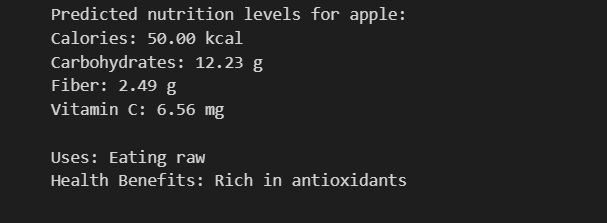

# NutriGuide-A Fruit and Vegetable Nutrition Chatbot

This project is a simple command-line based chatbot that predicts the nutritional content of various fruits and vegetables. Using the RandomForestRegressor from scikit-learn, the chatbot can provide estimates for calories, carbohydrates, fiber, and vitamin C content. Additionally, it provides information on common uses and health benefits of the specified fruit or vegetable.

## Features

- **Nutrition Prediction**:
  - Predicts the calorie, carbohydrate, fiber, and vitamin C content of fruits and vegetables using RandomForestRegressor models.
  
- **Item Information**:
  - Provides information on common uses and health benefits for each fruit and vegetable.

- **Interactive Chatbot**:
  - Simple command-line interface where users can enter the name of a fruit or vegetable to get predictions and information.
  - Type 'exit' to end the chat.

##Screenshots

-**Message requesting Input**
 -

- **User Input**
  - 
  
- **Output**
  - 
